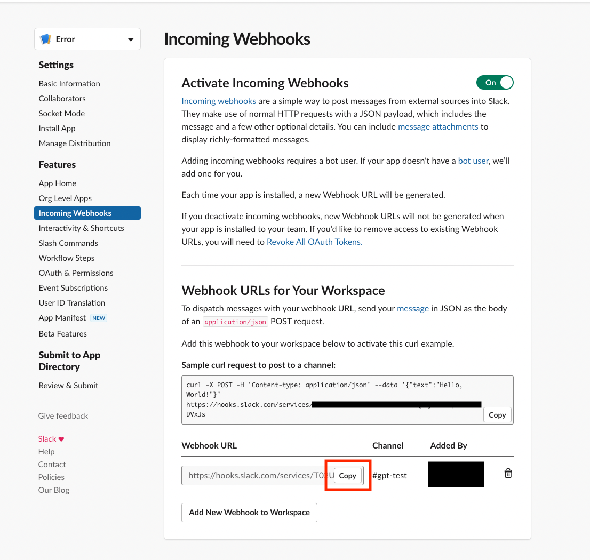

# KubeGPT
// Kubernetes의 Event를 기반으로 Slack에 Alert를 보내고 오류에 대한 GPT 답변을 받는 Operator

## Getting Started

### Prerequisites
- go version v1.20.0+
- docker version 17.03+.
- kubectl version v1.11.3+.
- Access to a Kubernetes v1.11.3+ cluster.

### Slack app setting
**Slack을 통한 메세지를 받기 위해서는 Slack app 구성이 필요합니다.**

1. https://api.slack.com/apps 에서 create new app을 선택합니다.

2. From an app manifest를 선택합니다.

3. 등록을 원하는 woekspace를 선택합니다.

4. 아래의 JSON을 복사하여 Slack app의 manifest에 붙여넣습니다. ${}에는 원하는 값을 넣어주시면 됩니다.
```
{
    "display_information": {
        "name": "${APP_NAME}",
        "description": "${APP_DESCRIPTION}",
        "background_color": "${APP_BACKGROUND_COLOR}",
    },
    "features": {
        "bot_user": {
            "display_name": "${BOT_DISPLAY_NAME}",
            "always_online": false
        }
    },
    "oauth_config": {
        "scopes": {
            "bot": [
                "chat:write",
                "incoming-webhook"
            ]
        }
    },
    "settings": {
        "org_deploy_enabled": false,
        "socket_mode_enabled": false,
        "token_rotation_enabled": false
    }
}
```
5. Install to Workspace로 APP을 추가하고 싶은 Slack 채널을 선택합니다.


6. Incoming Webhooks에서 Webhook URL을 복사합니다.


```sh
export SLACK_WEBHOOK_URL=<Webhook URL>
```

> **NOTE**: Slack URL은 외부에 공유되면 안됩니다.

<br>

---
<br>

### GPT setting
**GPT API를 사용하기 위해 API Key를 발급합니다.**
https://platform.openai.com/api-keys 에서 API Key를 발급받습니다.
Key를 복사해서 아래의 명령어를 실행합니다.
```sh
export OPENAI_API_KEY=<API Key>
```

>**NOTE**: API Key는 외부에 공유되면 안됩니다.

### Helm Install
**Helm Chart 설치**

```sh
helm repo add kubegpt https://kuberixenterprise.github.io/kubegpt/

helm repo update

helm install kubegpt  kubegpt/kubegpt -n kubegpt \
--set slack.webhook=${SLACK_WEBHOOK_URL} --set ai.token=${OPENAI_API_KEY} \
--create-namespace
```


## Contributing
// TODO(user): Add detailed information on how you would like others to contribute to this project

**NOTE:** Run `make --help` for more information on all potential `make` targets

More information can be found via the [Kubebuilder Documentation](https://book.kubebuilder.io/introduction.html)

## License

Copyright 2023.

Licensed under the Apache License, Version 2.0 (the "License");
you may not use this file except in compliance with the License.
You may obtain a copy of the License at

    http://www.apache.org/licenses/LICENSE-2.0

Unless required by applicable law or agreed to in writing, software
distributed under the License is distributed on an "AS IS" BASIS,
WITHOUT WARRANTIES OR CONDITIONS OF ANY KIND, either express or implied.
See the License for the specific language governing permissions and
limitations under the License.

