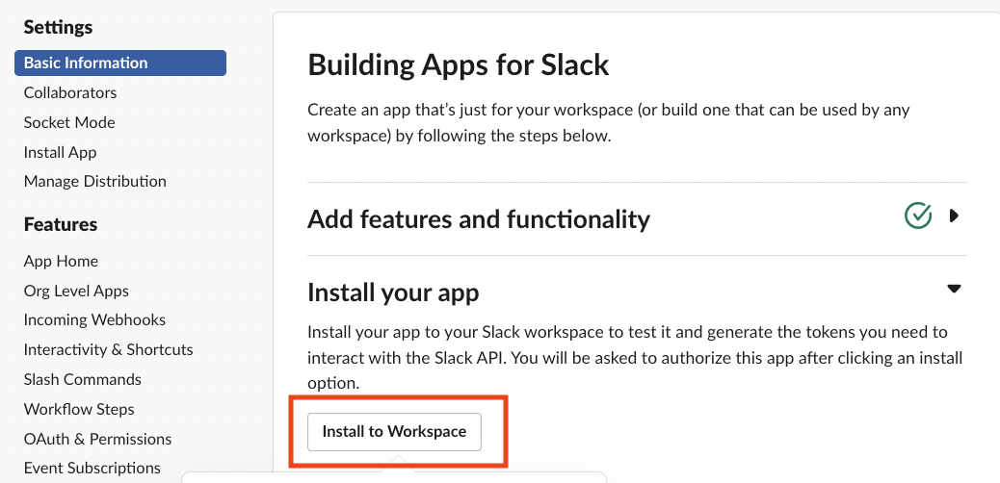

# KubeGPT
// Operator sending alerts to Slack based on events in Kubernetes and receiving GPT responses to errors.
   <br>


<br>

## Proceess


1. Get Event from the Kubernetes API server.
2. Receive a list of Events as a response from the API server.
3. Alert Error Events to Slack and store them in Cache.
4. Extract fields from the Event and query the GPT API.
5. Receive a response from the GPT.
6. Post the GPT response to Slack and store it in the cache.
7. For duplicate events, transmit from the cache to Slack at the predefined intervals.

<br>
## Getting Started
<br>
### Prerequisites
- go version v1.20.0+
- docker version 17.03+.
- kubectl version v1.11.3+.
- Access to a Kubernetes v1.11.3+ cluster.
<br>
   
### Slack app setting
**To receive messages via Slack, you need to configure the Slack app.**

1. https://api.slack.com/apps 에서 create new app을 선택합니다.

2. Select From an app manifest.

3. Select the workspace you want to register for.

4. Copy and paste the JSON below into your Slack app's manifest, replacing ${} with whatever you want.
``` 
{
    "display_information": {
        "name": "${APP_NAME}",
        "description": "${APP_DESCRIPTION}",
        "background_color": "${APP_BACKGROUND_COLOR}",
    },
    "features": {
        "bot_user": {
            "display_name": "${BOT_DISPLAY_NAME}",
            "always_online": false
        }
    },
    "oauth_config": {
        "scopes": {
            "bot": [
                "chat:write",
                "incoming-webhook"
            ]
        }
    },
    "settings": {
        "org_deploy_enabled": false,
        "socket_mode_enabled": false,
        "token_rotation_enabled": false
    }
}
```
5. Select the Slack channel you want to add the APP to with Install to Workspace.



6. Under Incoming Webhooks, copy the webhook URL.


```sh
export SLACK_WEBHOOK_URL=<Webhook URL>
```

> **NOTE**: Slack URLs shouldn't be shared externally.

<br>

---
<br>

### GPT setting
**Issue an API key to use the GPT API.**
Obtain your API key from https://platform.openai.com/api-keys.
Copy the key and run the code below.
```sh
export OPENAI_API_KEY=<API Key>
```

>**NOTE**: API keys shouldn't be shared externally.

### Helm Install
**Install Helm Chart**

```sh
helm repo add kubegpt https://kuberixenterprise.github.io/kubegpt/kubeGPT

helm repo update

helm install kubegpt  kubegpt/kubegpt -n kubegpt \
--set slack.webhook=${SLACK_WEBHOOK_URL} --set ai.token=${OPENAI_API_KEY} \
--create-namespace
```
